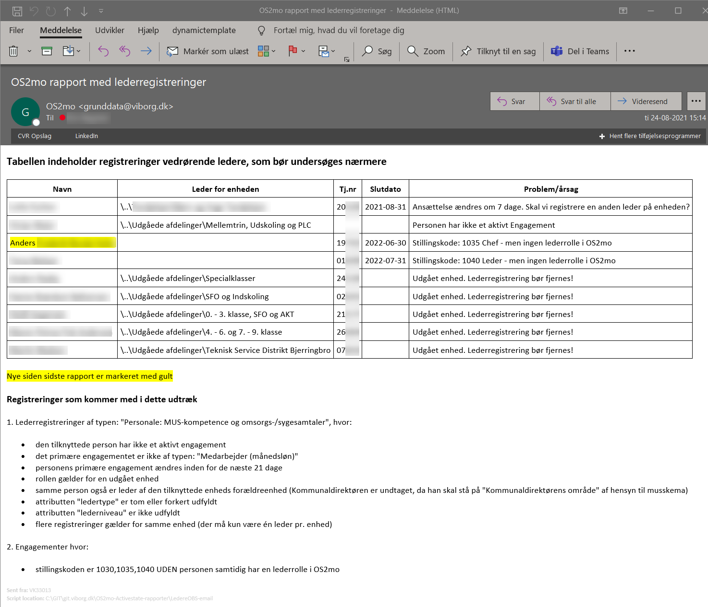

# OS2mo - Lederregistreringsrapport

Formålet med dette script er at opdage fejlbehæftede lederregistreringer og understøtte HR afdelingen i opgaven med at være på forkant med vedligeholdelse af lederroller i OS2mo.

Dette script gennemgår en række registreringer i OS2mo, som er relateret til ledere, og danner en e-mail rapport til HR afdelingen, som indeholder registreringer, som kan være problematiske. Der sendes kun en mail de dage, hvor der er nye registreringer som matcher filteret, men alle registreringer som matches kommer med hver gang mailen dannes (indtil fejlen er rettet eller problematikken ikke længere gør sig gældende).

Se en beskrivelse af hvilke registreringer der tjekkes for i beskrivelsen øverst i [Ledere_OBS_GetSQLdata.sql](Ledere_OBS_GetSQLdata.sql). I denne fil skal man også tilrette diverse variabler øverst, så de passer til eget miljø. Husk også at erstatte alle forekomster af [DBname].[DBuser] med sql server og brugernavn på ejer af tabellerne i databasen.

## Scriptet består af 2 powershell filer

**[Ledere_OBS_GetSQLdata.ps1](Ledere_OBS_GetSQLdata.ps1)**

Denne fil er baseret på Viborgs standardscript (og ps moduler) til udtræk af data fra OS2mo Actual state databasen, og scriptet anvender queryfilen: Ledere_OBS_GetSQLdata.sql som input. Som output dannes filen: Ledere_OBS.csv.

Dette script skal køres først. Brugeren som afvikler scriptet, skal have rettigheder til ActualState DB'en. Husk at tilrette variablerne, som angiver SQL servernavn og SQL databasenavn.

**[Ledere_OBS.ps1](Ledere_OBS.ps1)**

Dette er hovedscriptet, som danner rapporten og sender den. Husk at tilrette variablerne øverst. Scriptet gør i grove træk følgende:

* Indlæser Ledere_OBS.csv
* Sammenligner med Ledere_OBS_yesterday.csv (kopi af csv fil fra sidste kørsel af dette script) og finder evt. nye registreringer. Disse markeres med gult
* Konverterer data til en html tabel, og danner e-mail
* Sender e-mail, hvis der er nye poster i rapporten
* Overskriver Ledere_OBS_yesterday.csv med indholdet fra Ledere_OBS.csv

I Viborg kalder vi begge scripts via et overordnet script med noget udvidet logning. Dette script er ikke med her.

**[Eksempel på e-mail dannet via dette script](EksempelRapport.png)**

Elementer i kolonnen "Navn" er klikbare links, som åbner personen i OS2mo GUI.

Elementer i kolonnen "Leder for enheden" er klikbare links, som åbner enheden i OS2mo GUI.

